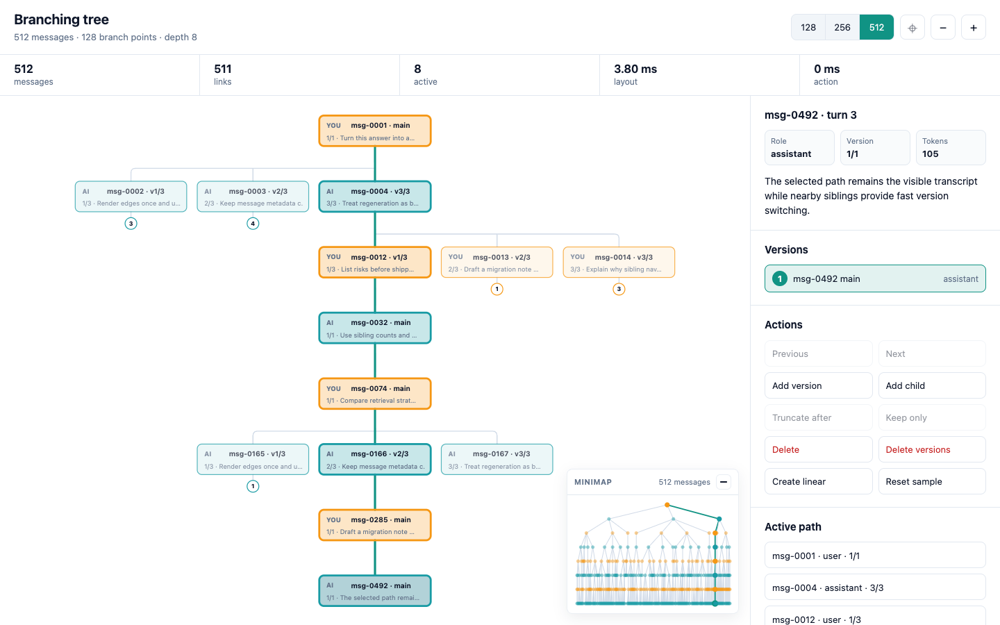

# Branching tree

Branchable state for chat transcripts, message versions, and selected-path tree
UIs.

[](https://www.typescriptlang.org/)
[](#quality-checks)
[](#quality-checks)
[](#demo)

<picture>
  <source
    media="(prefers-color-scheme: dark)"
    srcset="assets/demo-screenshot-dark.png"
  >
  <source
    media="(prefers-color-scheme: light)"
    srcset="assets/demo-screenshot-light.png"
  >
  
</picture>

`BranchingTree` is a tiny TypeScript data structure for branchable
conversations, versioned messages, and ordered trees with a cached active path.
It stores every branch, keeps one selected path ready for fast transcript
rendering, and exposes generic helpers for visualization, persistence, and
branch editing.

It was built for chat apps where every message can have multiple generated
versions. The API stays generic, so the same model also fits drafts, workflows,
edit histories, decision trees, and other branchable sequences.

## Table of contents

Use this README as both a quick start and an API reference.

- [Why branching tree?](#why-branching-tree)
- [Features](#features)
- [Getting started](#getting-started)
- [Basic usage](#basic-usage)
- [Chat app patterns](#chat-app-patterns)
- [Visualization helpers](#visualization-helpers)
- [API reference](#api-reference)
- [Demo](#demo)
- [Quality checks](#quality-checks)

## Why branching tree?

Most chat UIs render a single linear transcript, but real chat state is often a
tree: users edit prompts, assistants regenerate answers, and each turn can have
multiple versions. `BranchingTree` keeps that tree explicit while making the
currently selected conversation cheap to read.

## Features

Use `BranchingTree` when you need a focused state model for branchable data
without coupling your application to a chat-specific schema.

- ⚡ **O(1) active path reads:** `selectedPath` and `selectedPathEntries` are
  cached and rebuilt only after writes.
- 🌿 **Generic branching model:** Any value with an `id` can be stored in the
  tree.
- 🔁 **Version navigation:** Switch siblings by offset, index, id, or full path.
- 💾 **Serializable state:** Persist and restore the full tree with
  `BranchingTreeState<T>`.
- 🗺️ **Visualization-ready helpers:** Use `getSelectedPathNeighborhood()` and
  stable edge ids to build tree maps.
- 🧹 **Branch editing utilities:** Trim, delete, clone, and linearize branch
  state with focused helpers.
- ✅ **Fully covered core:** Unit tests enforce 100% statement, branch,
  function, and line coverage.

## Getting started

This repository is currently a source-only TypeScript package and isn't
published to npm. Clone the repository, then install dependencies with `pnpm`.

```sh
pnpm install
```

Run the interactive browser demo from the self-contained `demo/` Vite app:

```sh
pnpm run dev
```

Run formatting, linting, type checking, and unit tests with coverage:

```sh
pnpm run check
```

## Basic usage

Create a tree with values that include an `id` string. Appending adds a value as
a child of the current `head`, or as a child of the root when the tree is empty.

```ts
import { BranchingTree } from "./branching-tree";

type Message = {
  id: string;
  role: "user" | "assistant";
  content: string;
};

const tree = new BranchingTree<Message>();

tree.append({ id: "user-1", role: "user", content: "Draft an intro." });
tree.append({ id: "assistant-1a", role: "assistant", content: "Version A" });
tree.addSibling("assistant-1a", {
  id: "assistant-1b",
  role: "assistant",
  content: "Version B",
});

console.log(tree.selectedPath);
// [
//   { id: "user-1", role: "user", content: "Draft an intro." },
//   { id: "assistant-1b", role: "assistant", content: "Version B" },
// ]
```

## Chat app patterns

Use siblings as message versions. The selected sibling at each depth forms the
visible conversation, while unselected siblings remain available for version
switching.

```ts
// Generate another assistant version without switching away from the active one.
tree.addSibling(
  "assistant-1b",
  { id: "assistant-1c", role: "assistant", content: "Version C" },
  { select: false },
);

// Render version controls for the active assistant message.
const versions = tree.getSiblingEntries("assistant-1b");
// versions[1]?.selected === true
// versions[1]?.siblingCount === 3

// Switch directly to a different version.
tree.selectSiblingById("assistant-1c");

// Stream tokens into the active assistant message.
tree.updateHead({
  id: "assistant-1c",
  role: "assistant",
  content: "Version C with more text",
});

// Regenerate after a user message by pruning later messages first.
tree.truncateAfter("user-1");
tree.append({ id: "assistant-2", role: "assistant", content: "New answer" });
```

`selectedPath` and `selectedPathEntries` are cached, so reading the active
conversation and its version metadata is O(1). Tree writes rebuild those cached
arrays.

## Visualization helpers

Use `getSelectedPathNeighborhood()` when you need data for a tree map like the
demo. The helper returns only graph facts: which nodes are visible, how they
relate to each other, which ones are selected, and how many direct children are
hidden. It doesn't include coordinates or rendering details.

```ts
const graph = tree.getSelectedPathNeighborhood();

for (const node of graph.nodes) {
  console.log(node.nodeId, node.depth, node.siblingIndex, node.hiddenChildCount);
}

for (const edge of graph.edges) {
  console.log(edge.parentId, edge.childId, edge.selected);
}
```

Limit the neighborhood when you want a focused view around the active path:

```ts
const focusedGraph = tree.getSelectedPathNeighborhood({
  maxDepth: 4,
  siblingWindow: 1,
});
```

Use `getFullTopology()` when you need every reachable value in the tree without
layout coordinates:

```ts
const topology = tree.getFullTopology();
```

Use `getBranchSummary(id)` when you need cheap subtree facts for collapsed
branches, badges, or inspectors:

```ts
const summary = tree.getBranchSummary("assistant-1b");
// { descendantCount, leafCount, maxDepth, branchPoints }
```

Each `BranchingTreePathNeighborhoodNode<T>` includes the same fields as
`BranchingTreeSiblingEntry<T>`, plus these map-oriented fields:

- `depth` is the selected-path depth where the node appears.
- `childCount` is the total number of direct children under the node.
- `hiddenChildCount` is the number of direct children that aren't visible in the
  returned neighborhood.

Each `BranchingTreePathNeighborhoodEdge` includes these fields:

- `id` is a stable edge id from `BranchingTree.createEdgeId(parentId, childId)`.
- `parentId` and `childId` identify the connected nodes.
- `selected` is `true` when the edge is part of the active selected path.

`getFullTopology()` returns the same edge shape and
`BranchingTreeTopologyNode<T>` entries for every reachable valued node.

## API reference

The API is intentionally small. These sections group the read, write, selection,
deletion, and state-helper methods by the workflow they support.

### Core concepts

The tree stores all branches, but `selectedPath` returns only the currently
selected path from the root to a leaf.

- `ROOT_NODE_ID` identifies the sentinel root node.
- `BranchingTreeNode<T>` stores a value, parent id, child ids, and selected
  child index.
- `BranchingTreeState<T>` is the serializable tree state.
- `BranchingTreePathEntry<T>` describes a selected path value plus its sibling
  metadata.
- `BranchingTreeSiblingEntry<T>` describes a sibling and whether it's selected.
- `BranchingTreeTopology<T>` describes every reachable valued node and edge.
- `BranchingTreeBranchSummary` describes subtree counts for one node.
- `selectedPath` returns the cached selected values in O(1) time.
- `selectedPathEntries` returns cached selected values plus sibling metadata in
  O(1) time.
- `head` returns the last value in `selectedPath`, or `null` for an empty tree.

### Reading data

Read APIs either return immutable cached arrays or cloned node structures, so
callers can't accidentally mutate the tree shape.

- `selectedPath` returns the active values from root to leaf.
- `selectedPathEntries` returns the active values with `siblingIndex`,
  `siblingCount`, `hasPreviousSibling`, and `hasNextSibling`.
- `head` returns the active leaf value.
- `hasNode(id)`, `hasParent(id)`, and `hasChildren(id)` return boolean checks.
- `getNode(id)` returns a cloned node, or `undefined` when the id doesn't
  exist.
- `getValue(id)` returns a node value, or `undefined` when the id doesn't exist
  or points to an unvalued root.
- `getSiblingPosition(id)` returns `{ current, total }` using one-based indexes.
- `getSiblings(id)` returns cloned sibling nodes for the referenced node.
- `getChildren(id)` returns cloned child nodes for the referenced node.
- `getSiblingValues(id)` returns sibling values for the referenced node.
- `getChildValues(id)` returns child values for the referenced node.
- `getSiblingEntries(id)` returns sibling values with selection metadata.
- `getChildEntries(id)` returns child values with selection metadata relative to
  the referenced parent node.
- `getPathEntriesTo(id)` returns path entries from the root to a node without
  changing the selected path.
- `getFullTopology()` returns every reachable valued node and edge without
  layout coordinates.
- `getBranchSummary(id)` returns subtree counts for descendants, leaves, depth,
  and branch points, or `null` when the node doesn't exist.
- `getSelectedPathNeighborhood(options)` returns the active path plus each
  active node's visible siblings as graph nodes and edges. Optional `maxDepth`
  and `siblingWindow` values narrow the returned neighborhood.
- `getSelectedPathState()` returns a serializable state containing only the
  current selected path. It preserves the selected nodes' ids and values while
  pruning all inactive siblings and descendants.
- `getStats()` reports node count, selected path length, depth, leaves, branch
  points, and unreachable nodes.

### Writing data

Write APIs keep selection explicit. By default, inserted siblings become the
selected branch. Pass `{ select: false }` to keep the current selected sibling
when the parent already has a child. The first child of a parent is always the
selected child because there is no alternative branch yet.

- `append(value, options)` inserts a value after the current `head`.
- `appendChild(parentId, value, options)` inserts a value under a specific
  parent.
- `addSibling(referenceId, value, options)` creates a sibling next to an
  existing node.
- `update(value)` replaces an existing node value by `id`.
- `updateHead(value)` replaces the current `head` value without searching the
  tree. This is useful for streaming updates to the active leaf.
- `upsert(value, options)` updates an existing value or appends a new one.
- `loadState(state)` validates and loads a serialized state object.
- `reset(rootId)` clears the tree and creates a new root node.

### Selecting branches

Selection APIs change which sibling is active at a branch point. In a chat app,
these methods switch between message versions.

- `selectSibling(id, offset)` moves selection among siblings by offset.
- `selectSiblingAt(id, index)` selects a sibling by zero-based index in the
  referenced node's sibling group.
- `selectSiblingById(id)` selects an existing non-root node by id and selects
  the ancestor path needed to reach it.
- `selectPathTo(id)` selects every parent-to-child edge needed to reach a node.

### Deleting branches

Deletion APIs remove subtrees and then rebuild the cached selected path. Methods
return `false` when there is nothing to delete.

- `deleteNode(id)` removes a node and its descendants.
- `deleteBranch(id)` is an alias for `deleteNode(id)` when the call site is
  branch-oriented.
- `deleteDescendants(id)` keeps a node and removes all children below it.
- `truncateAfter(id)` selects the path to a node, then removes everything below
  it.
- `deleteSiblings(id)` removes every sibling of the referenced node, including
  the referenced node.
- `deleteSiblings(id, { keepTarget: true })` removes every sibling except the
  referenced node.

### State helpers

Static helpers create ids and serializable state without mutating an existing
tree instance. They are useful when importing linear data, duplicating a tree,
or generating ids with the same convention as the library.

#### `createNodeId(prefix)`

`createNodeId` returns a string id with a prefix and a random suffix. The
default prefix is `node`, so `BranchingTree.createNodeId()` returns ids shaped
like `node-abc123`.

```ts
const id = BranchingTree.createNodeId("message");
```

#### `createEdgeId(parentId, childId)`

`createEdgeId` returns a stable string id for a parent-to-child edge. Use it
when you need a key for rendered edge elements.

```ts
const edgeId = BranchingTree.createEdgeId("message-1", "message-2");
// edgeId === "message-1->message-2"
```

#### `createLinearState(values, options)`

`createLinearState` converts an array into a single selected path under a root
node. Every input value receives a new id, and the return type is
`BranchingTreeState<Reidentified<T>>`.

Use this helper when you want to import existing values but don't want to reuse
their current ids.

```ts
const linearState = BranchingTree.createLinearState(
  [
    { id: "source-user", role: "user", content: "Hello" },
    { id: "source-assistant", role: "assistant", content: "Hi" },
  ],
  {
    idFactory: (() => {
      const ids = ["user-1", "assistant-1"];
      return () => ids.shift() ?? "unused";
    })(),
  },
);
```

The optional `options` object supports these fields:

- `idFactory` generates the id for each non-root value.
- `idPrefix` is passed to `createNodeId` when `idFactory` isn't provided.
- `rootId` sets the root node id. The default is `ROOT_NODE_ID`.

#### `cloneStateWithNewIds(state, options)`

`cloneStateWithNewIds` copies an existing tree state while preserving its
structure, selected child indexes, and values. It assigns a new id to every
non-root node and rewrites parent and child references to match.

Use this helper when you need a duplicate tree that won't collide with ids from
the source state.

```ts
const clonedState = BranchingTree.cloneStateWithNewIds(linearState, {
  idPrefix: "copy",
});
```

The optional `options` object supports these fields:

- `idFactory` generates the new id for each non-root node.
- `idPrefix` is passed to `createNodeId` when `idFactory` isn't provided.
- `rootId` sets the cloned root id. The default is the source state's `rootId`.

Both state helpers copy each value with its generated id:

```ts
const clonedValue = clonedState.nodes["copy-abc123"]?.value;
// clonedValue?.id === "copy-abc123"
```

## Demo

The repository includes an ArrowJS-powered browser demo that loads a large
chat-like branching tree and renders it as a top-down conversation version map.
The visible map stays focused on the selected path and sibling versions, keeps
reused nodes in stable positions when switching versions, and uses compact
subtree badges for hidden descendants.

The demo lives in `demo/`: `demo/index.html` is the Vite HTML entry,
`demo/main.ts` mounts the ArrowJS shell, and the same entry imports
`demo/styles.css`.

The demo supports drag-to-pan, wheel zoom, zoom buttons, Shift-wheel pan,
double-click zoom, fit-to-view, size presets, click-to-select nodes, keyboard
navigation, sibling version switching, active path highlighting, a collapsible
minimap, adding versions and child messages, truncating after a message,
deleting from a selected message, and pruning message versions with or without
keeping the selected version. It also includes a create-linear action backed by
`getSelectedPathState()` and uses `getSelectedPathNeighborhood()` for map
rendering. New demo messages use `BranchingTree.createNodeId`.
The minimap uses `getFullTopology()` for whole-tree graph facts.

Open the local Vite URL printed by the command. The demo remembers node
coordinates across version switches, reuses existing SVG elements where possible,
appends only newly needed nodes for the selected path window, and preserves zoom
and pan across browser tab visibility and resize events. This keeps path
switching responsive on trees with hundreds of messages.

Build the demo production bundle with Vite when you want to inspect output size:

```sh
pnpm exec vite build demo
```

## Quality checks

The project uses TypeScript, Vitest, and Biome. The `check` script runs
format checking, linting, type checking, and unit tests with coverage.

```sh
pnpm run check
```

Coverage thresholds are set to 100% for statements, branches, functions, and
lines in `vitest.config.ts`.
